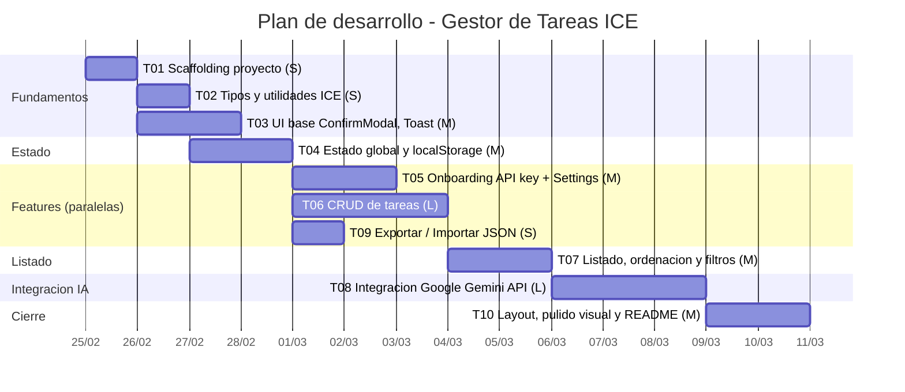

# Planning: Gestor de Tareas Inteligente con modelo ICE

Plan de tareas para implementar el MVP definido en `MVP_Gestor_Tareas_Inteligente_ICE.md`.

- **Desarrollador**: 1 persona.
- **Coste**: estimado en tallas (S / M / L / XL).
- **Orden de ejecucion**: priorizado por dependencias. Donde no hay dependencia directa se indica paralelismo logico.

---

## Referencia de tallas

| Talla | Esfuerzo aproximado | Descripcion                                      |
| ----- | ------------------- | ------------------------------------------------ |
| S     | ~1-2h               | Tarea simple, poco codigo, bajo riesgo           |
| M     | ~3-4h               | Tarea media, varios archivos, logica moderada    |
| L     | ~5-8h               | Tarea grande, logica compleja o muchos componentes|
| XL    | ~8h+                | Tarea muy grande, investigacion + implementacion |

---

## Tareas

### T01 - Scaffolding del proyecto

| Campo         | Valor                |
| ------------- | -------------------- |
| **Prioridad** | 1 (primera)          |
| **Talla**     | S                    |
| **Depende de**| Ninguna              |

**Que hacer:**

- Crear proyecto con `npm create vite@latest` (template `react-ts`).
- Instalar y configurar Tailwind CSS v4 (o v3 con `tailwind.config.js` + `postcss.config.js`).
- Verificar que `npm run dev` arranca y se ve un componente con clases Tailwind.
- Limpiar boilerplate de Vite (eliminar `App.css`, assets por defecto, etc.).
- Crear estructura de carpetas base:
  ```
  src/
    components/
    hooks/
    services/
    types/
    utils/
  ```
- Comprobar que el build (`npm run build`) funciona sin errores.

**Entregable:** Proyecto arrancable con Tailwind funcionando y estructura de carpetas vacia.

---

### T02 - Tipos TypeScript y utilidades ICE

| Campo         | Valor                |
| ------------- | -------------------- |
| **Prioridad** | 2                    |
| **Talla**     | S                    |
| **Depende de**| T01                  |

**Que hacer:**

- Crear `src/types/task.ts` con los tipos:
  - `TaskStatus = 'backlog' | 'doing' | 'done'`
  - `IceScore` (impact?, confidence?, ease?, score?, rationale?, source?)
  - `Task` (id, title, description?, status, createdAt, updatedAt, ice)
- Crear `src/utils/ice.ts` con:
  - `calculateIceScore(i?, c?, e?): number | undefined` — devuelve `Math.round((i+c+e)/3)` o `undefined` si falta alguno.
  - `clampIce(value: number): number` — clamp a 0..100 y `Math.round`.
  - `sanitizeIceValue(raw: unknown): number | undefined` — parsea, redondea y clampea un valor recibido (de formulario o de la IA).
- Crear `src/utils/task.ts` con:
  - `createTask(title, description?): Task` — genera id con `crypto.randomUUID()`, timestamps ISO, estado `backlog`, ice vacio.
  - `hasAnyIce(task: Task): boolean` — true si al menos uno de I/C/E tiene valor.
  - `hasCompleteIce(task: Task): boolean` — true si los tres estan definidos.

**Entregable:** Archivos de tipos y utilidades puras, sin dependencia de React. Se pueden testear manualmente o con console.

---

### T03 - Componentes UI base (ConfirmModal, Toast)

| Campo         | Valor                |
| ------------- | -------------------- |
| **Prioridad** | 2 (paralela con T02) |
| **Talla**     | M                    |
| **Depende de**| T01                  |

**Que hacer:**

Estos son componentes reutilizables que se usaran en muchas tareas posteriores.

**`ConfirmModal`** (`src/components/ConfirmModal.tsx`):
- Props: `isOpen`, `title`, `message`, `confirmLabel`, `cancelLabel`, `variant ('primary' | 'destructive')`, `onConfirm`, `onCancel`.
- Renderiza overlay semitransparente (`bg-black/50`) + panel centrado (`rounded-lg shadow-xl bg-white`).
- Boton confirmar: azul por defecto, rojo si `variant='destructive'`.
- Cierra con: boton cancelar, boton X, clic fuera del panel, tecla Escape.
- Usa `createPortal` para renderizar en `document.body` (evitar problemas de z-index).

**`Toast`** (`src/components/Toast.tsx`):
- Props: `message`, `type ('success' | 'error')`, `onClose`.
- Posicion fija esquina superior derecha (`fixed top-4 right-4`).
- Fondo verde claro para exito (`bg-green-50 text-green-800 border-green-200`).
- Fondo rojo claro para error (`bg-red-50 text-red-800 border-red-200`).
- Boton X para cerrar manualmente.
- Auto-dismiss: 3s para exito, 5s para error (con `useEffect` + `setTimeout`).

**`ToastProvider` / hook `useToast`** (`src/hooks/useToast.ts`):
- Context que gestiona una cola de toasts.
- Expone `showToast(message, type)` para que cualquier componente pueda lanzar un toast.
- Renderiza los toasts activos apilados verticalmente.

**Entregable:** Componentes visuales funcionales que se pueden probar de forma aislada montandolos en `App` temporalmente.

---

### T04 - Estado global y persistencia en localStorage

| Campo         | Valor                |
| ------------- | -------------------- |
| **Prioridad** | 3                    |
| **Talla**     | M                    |
| **Depende de**| T02                  |

**Que hacer:**

**Hook `useLocalStorage`** (`src/hooks/useLocalStorage.ts`):
- Hook generico: `useLocalStorage<T>(key: string, initialValue: T): [T, (value: T) => void]`.
- Lee de `localStorage` al montar. Si no hay valor, usa `initialValue`.
- En cada `set`, escribe en `localStorage` con `JSON.stringify`.
- Gestionar errores de parsing silenciosamente (si el JSON esta corrupto, usar `initialValue`).

**Contexto de tareas** (`src/hooks/useTaskStore.ts` o `src/context/TaskContext.tsx`):
- Usar `useReducer` con acciones:
  - `ADD_TASK` — recibe titulo y descripcion, crea la tarea con `createTask()`.
  - `UPDATE_TASK` — recibe id y campos parciales, recalcula ICE si cambian I/C/E.
  - `DELETE_TASK` — recibe id.
  - `SET_TASKS` — reemplaza todas las tareas (para importar JSON).
- Persistir el array de tareas con `useLocalStorage` (clave `tasks`).
- Provider `TaskProvider` que envuelve la app y expone `state` y `dispatch` (o funciones helper como `addTask`, `updateTask`, `deleteTask`, `setTasks`).

**Contexto de API key** (`src/hooks/useApiKey.ts`):
- `useLocalStorage<string>('gemini_api_key', '')`.
- Exponer: `apiKey`, `setApiKey`, `clearApiKey`, `hasApiKey` (booleano derivado).
- Envolver en un `ApiKeyProvider` o integrar en un contexto general `AppProvider`.

**Entregable:** Providers funcionales. Se puede verificar abriendo React DevTools y viendo que el estado se actualiza, y recargando la pagina para comprobar persistencia.

---

### T05 - Onboarding de API key y Settings

| Campo         | Valor                         |
| ------------- | ----------------------------- |
| **Prioridad** | 4 (paralela con T06 y T09)    |
| **Talla**     | M                             |
| **Depende de**| T03, T04                      |

**Que hacer:**

**`ApiKeySetup`** (`src/components/ApiKeySetup.tsx`):
- Pantalla completa centrada (flex, min-h-screen, bg gris claro).
- Titulo: "Gestor de Tareas ICE".
- Subtitulo: "Configurar API Key de Gemini".
- Texto explicativo y link a `https://aistudio.google.com/apikey` (target `_blank`).
- Input de texto (`type="text"`, placeholder "Pega tu API key aqui").
- Boton "Guardar y continuar" — deshabilitado si input vacio, al clicar llama a `setApiKey(value)`.
- Toast de exito "API key guardada" al guardar.

**`SettingsModal`** (`src/components/SettingsModal.tsx`):
- Modal (reutiliza el patron overlay de `ConfirmModal` o lo compone encima).
- Muestra la key enmascarada: primeros 4 chars + "..." + ultimos 4 chars.
- Input para cambiar la key.
- Boton "Guardar" — actualiza la key, muestra toast de exito, cierra el modal.
- Boton "Eliminar key" — abre `ConfirmModal` con variant `destructive` y mensaje "Si eliminas la API key tendras que volver a introducirla. ¿Continuar?". Si confirma: `clearApiKey()`.

**Logica en `App.tsx`:**
- Si `!hasApiKey`: renderizar `<ApiKeySetup />`.
- Si `hasApiKey`: renderizar la vista principal.

**Entregable:** Al abrir la app sin key se ve el onboarding. Tras guardar la key se ve la vista principal (aunque este vacia de momento). Al recargar no vuelve a pedir la key. Desde settings se puede cambiar o eliminar.

---

### T06 - CRUD de tareas

| Campo         | Valor                         |
| ------------- | ----------------------------- |
| **Prioridad** | 4 (paralela con T05 y T09)    |
| **Talla**     | L                             |
| **Depende de**| T03, T04                      |

**Que hacer:**

**`TaskModal`** (`src/components/TaskModal.tsx`):
- Props: `isOpen`, `task?` (si viene, es edicion; si no, creacion), `onSave`, `onClose`.
- Formulario con:
  - Titulo: `<input type="text">`, obligatorio. Validar que no este vacio al guardar.
  - Descripcion: `<textarea>`, opcional.
  - Estado: `<select>` con opciones backlog/doing/done. Solo visible en modo edicion (en creacion siempre es backlog).
  - Seccion "Puntuacion ICE (opcional)":
    - Tres inputs `<input type="number" min="0" max="100" step="1">` para Impact, Confidence, Ease.
    - Si se dejan vacios, se guardan como `undefined`.
    - Si tienen valor, se sanitizan con `sanitizeIceValue`.
  - Nota visible: "Enteros de 0 a 100. Dejar vacio si no se quiere definir."
- Boton "Cancelar" cierra el modal.
- Boton "Guardar":
  - Valida titulo no vacio (si vacio, mostrar borde rojo en el input y texto de error).
  - Llama a `addTask` o `updateTask` segun el modo.
  - Cierra el modal.

**Eliminar tarea:**
- Al pulsar "Eliminar" en una tarjeta, abrir `ConfirmModal`:
  - `title`: "Eliminar tarea"
  - `message`: "¿Seguro que quieres eliminar «{task.title}»? Esta accion no se puede deshacer."
  - `variant`: "destructive"
  - `confirmLabel`: "Eliminar"
- Si confirma: llamar a `deleteTask(task.id)`.

**Cambiar estado desde tarjeta:**
- `<select>` en la tarjeta con los tres estados.
- `onChange` llama a `updateTask(task.id, { status: newStatus })` directamente (sin confirmacion).

**Entregable:** Se pueden crear tareas, editarlas (abriendo el modal pre-rellenado), eliminarlas (con confirmacion por modal), y cambiar estado desde la tarjeta. Todo persiste en localStorage.

---

### T07 - Listado, ordenacion y filtros

| Campo         | Valor                |
| ------------- | -------------------- |
| **Prioridad** | 5                    |
| **Talla**     | M                    |
| **Depende de**| T06                  |

**Que hacer:**

**`IceBadge`** (`src/components/IceBadge.tsx`):
- Props: `ice: IceScore`.
- Si `ice.score` tiene valor: mostrar el numero grande (ej: `text-3xl font-bold`), etiqueta "ICE Score" debajo.
- Si `ice.score` es undefined: mostrar "Pendiente" en gris con estilo atenuado.
- Desglose I/C/E debajo: tres items en fila, cada uno con label y valor (o "–" si undefined).
- Si `ice.source === 'ai'` y hay `rationale`: mostrar etiqueta "Fuente: IA" y la justificacion en texto italic pequeno.

**`TaskCard`** (`src/components/TaskCard.tsx`):
- Props: `task`, `onEdit`, `onDelete`, `onEstimateIce`.
- Layout segun wireframe: titulo + select estado arriba, IceBadge en el centro, botones abajo.
- Badge de estado con colores: backlog (gris), doing (amarillo/azul), done (verde).
- Botones: "Calcular ICE con IA", "Editar", "Eliminar".

**`TaskList`** (`src/components/TaskList.tsx`):
- Recibe el array de tareas del contexto.
- Aplica filtros y ordenacion antes de renderizar.
- Si la lista filtrada esta vacia: mostrar un empty state ("No hay tareas" o "Sin resultados").

**`Toolbar`** (`src/components/Toolbar.tsx`):
- Boton "+ Nueva tarea" — abre `TaskModal` en modo creacion.
- Input de busqueda — filtra por titulo y descripcion (case insensitive, `includes`).
- Select de estado — `Todos | Backlog | Doing | Done`.
- Select de orden — `ICE (mayor primero) | Fecha (reciente primero) | Titulo (A-Z)`.
- El estado de filtros/busqueda/orden se gestiona con `useState` local en la pagina principal (no necesita persistencia).

**Logica de ordenacion:**
- ICE desc: comparar `score ?? -1` para que los pendientes vayan al final.
- Fecha: comparar `createdAt` como string ISO (orden lexicografico = cronologico).
- Titulo: `localeCompare`.

**Entregable:** La vista principal muestra las tareas como tarjetas, se puede buscar por texto, filtrar por estado y cambiar el orden. La lista reacciona en tiempo real a cambios.

---

### T08 - Integracion con Google Gemini API

| Campo         | Valor                |
| ------------- | -------------------- |
| **Prioridad** | 6                    |
| **Talla**     | L                    |
| **Depende de**| T05, T07             |

**Que hacer:**

**Servicio Gemini** (`src/services/gemini.ts`):
- Funcion `estimateIce(apiKey: string, title: string, description: string): Promise<IceScore>`.
- Construir el body del request:
  ```ts
  {
    contents: [{
      parts: [{ text: prompt }]
    }]
  }
  ```
  donde `prompt` es el prompt definido en la especificacion (seccion 8.2 del MVP).
- Hacer `fetch` POST al endpoint: `https://generativelanguage.googleapis.com/v1beta/models/gemini-2.0-flash:generateContent?key=${apiKey}`.
- Headers: `Content-Type: application/json`.
- Parsear la respuesta:
  1. Extraer el texto de `response.candidates[0].content.parts[0].text`.
  2. Intentar `JSON.parse`.
  3. Si falla, buscar el primer `{...}` con regex y parsear.
  4. Validar que `impact`, `confidence`, `ease` sean numeros.
  5. Sanitizar con `clampIce` / `Math.round`.
  6. Calcular `score` con `calculateIceScore`.
  7. Devolver `IceScore` con `source: 'ai'`.
- Si cualquier paso falla: lanzar un `Error` con mensaje descriptivo.
- Gestionar HTTP errors: si `response.ok` es false, leer el body y lanzar error con el mensaje de la API.

**`AiEstimateButton`** (`src/components/AiEstimateButton.tsx`):
- Props: `task`, `onEstimated(iceScore: IceScore)`.
- Estado local: `isLoading` (boolean), `showConfirm` (boolean).
- Logica de deshabilitado:
  - Si `!task.description`: disabled, tooltip "Añade una descripcion para poder estimar con IA".
  - Si `!hasApiKey`: disabled, tooltip "Configura tu API key primero".
- Al pulsar:
  1. Abrir `ConfirmModal` con el mensaje apropiado (diferente si ya tiene ICE o no).
  2. Si confirma:
     - `setIsLoading(true)`.
     - Llamar a `estimateIce(apiKey, task.title, task.description)`.
     - En exito: llamar `onEstimated(result)`, mostrar toast de exito.
     - En error: mostrar toast de error con el mensaje.
     - `setIsLoading(false)`.
  3. Si cancela: cerrar el modal.
- En estado loading: mostrar spinner (animacion Tailwind `animate-spin` en un icono SVG basico) + texto "Calculando..." + boton disabled.

**Integrar en `TaskCard`:**
- Conectar `AiEstimateButton` con la accion `updateTask` para guardar los valores I/C/E devueltos por la IA.

**Entregable:** Al pulsar "Calcular ICE con IA" en una tarjeta con descripcion, se muestra confirmacion, se llama a Gemini, y los valores se guardan en la tarea. Los errores se muestran como toast sin romper la app.

---

### T09 - Exportar / Importar JSON

| Campo         | Valor                         |
| ------------- | ----------------------------- |
| **Prioridad** | 4 (paralela con T05 y T06)    |
| **Talla**     | S                             |
| **Depende de**| T03, T04                      |

**Que hacer:**

**Exportar** (`src/utils/exportImport.ts` + boton en Header):
- Funcion `exportTasks(tasks: Task[]): void`:
  - Serializar a JSON con `JSON.stringify(tasks, null, 2)`.
  - Crear un `Blob` con type `application/json`.
  - Crear un link temporal con `URL.createObjectURL`, atributo `download="tareas-ice.json"`.
  - Hacer click programatico y revocar la URL.
- Boton "Exportar" en el `Header`.

**Importar** (`src/utils/exportImport.ts` + boton en Header):
- Boton "Importar" abre un `<input type="file" accept=".json">` oculto.
- Al seleccionar archivo:
  1. Leer con `FileReader` como texto.
  2. Parsear con `JSON.parse`.
  3. Validar que sea un array y que cada elemento tenga al menos `id` y `title` (validacion basica).
  4. Abrir `ConfirmModal`: "Esto reemplazara todas las tareas actuales. ¿Quieres continuar?".
  5. Si confirma: `setTasks(parsedTasks)`, toast exito "Tareas importadas correctamente".
  6. Si error de parsing: toast error "Error al importar: formato de archivo no valido".

**Entregable:** Desde el header se pueden exportar las tareas a un `.json` y reimportarlas. Al importar se pide confirmacion y se sobreescriben las tareas actuales.

---

### T10 - Layout final, pulido visual y README

| Campo         | Valor                |
| ------------- | -------------------- |
| **Prioridad** | 7 (ultima)           |
| **Talla**     | M                    |
| **Depende de**| T08, T09             |

**Que hacer:**

**`Header`** (`src/components/Header.tsx`):
- Layout definitivo: titulo a la izquierda, botones a la derecha (Exportar, Importar, Configuracion/engranaje).
- Estilos: fondo blanco o azul oscuro, sombra inferior, sticky top.

**Layout de `App.tsx`:**
- Ensamblar: `Header` + `Toolbar` + `TaskList`.
- Contenedor centrado con max-width (`max-w-4xl mx-auto`).
- Padding general, fondo gris claro para el body.

**Pulido visual general:**
- Revisar que todas las tarjetas, modales y botones tengan aspecto coherente.
- Verificar estados hover/focus/disabled en botones.
- Responsive basico: que en pantallas pequenas los cards ocupen el 100% y la toolbar haga wrap.
- Empty state cuando no hay tareas: texto centrado con icono y boton "Crear tu primera tarea".

**README.md:**
- Titulo y breve descripcion del proyecto.
- Seccion "Requisitos": Node.js >= 18.
- Seccion "Instalacion y ejecucion": `npm install` + `npm run dev`.
- Seccion "API Key": explicar que al abrir la app se pide la key, con link a Google AI Studio para obtenerla gratis.
- Seccion "Limitaciones": key en localStorage, sin backend, limites del free tier.
- Screenshot o GIF opcional (placeholder en el README).

**Entregable:** App visualmente terminada, coherente, responsive basico, con README listo para usar en el curso.

---

## Resumen de tareas

| ID   | Tarea                                    | Talla | Depende de   |
| ---- | ---------------------------------------- | ----- | ------------ |
| T01  | Scaffolding del proyecto                 | S     | —            |
| T02  | Tipos TypeScript y utilidades ICE        | S     | T01          |
| T03  | Componentes UI base (ConfirmModal, Toast)| M     | T01          |
| T04  | Estado global y persistencia localStorage| M     | T02          |
| T05  | Onboarding de API key y Settings         | M     | T03, T04     |
| T06  | CRUD de tareas                           | L     | T03, T04     |
| T07  | Listado, ordenacion y filtros            | M     | T06          |
| T08  | Integracion con Google Gemini API        | L     | T05, T07     |
| T09  | Exportar / Importar JSON                 | S     | T03, T04     |
| T10  | Layout final, pulido visual y README     | M     | T08, T09     |

---

## Diagrama de Gantt



### Camino critico

```
T01 → T02 → T04 → T06 → T07 → T08 → T10
 S      S     M     L     M     L     M
```

Duracion estimada del camino critico: **S + S + M + L + M + L + M = ~25-32h de trabajo efectivo**.

### Tareas paralelizables

Aunque hay un unico desarrollador, estas tareas no tienen dependencia entre si y podrian intercalarse:

- **T02 y T03** (ambas solo dependen de T01).
- **T05, T06 y T09** (las tres dependen de T03 + T04, pero no entre ellas).

---

## Grafo de dependencias

```
T01 (Scaffolding)
 ├── T02 (Tipos/utils)
 │    └── T04 (Estado/localStorage)
 │         ├── T05 (API key onboarding)  ──┐
 │         ├── T06 (CRUD tareas)           │
 │         │    └── T07 (Listado/filtros)  │
 │         │         └─────────────────────┤
 │         │                               ├── T08 (Gemini API)
 │         │                               │    └── T10 (Layout/README)
 │         └── T09 (Export/Import) ────────────────┘
 └── T03 (UI base) ───────┘
```
